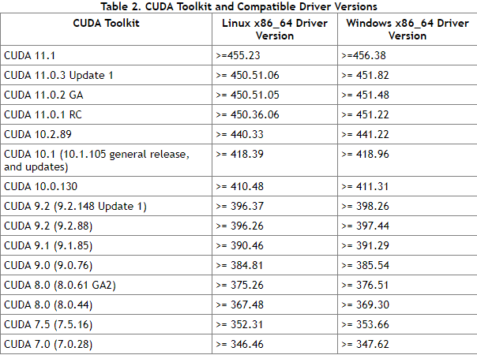
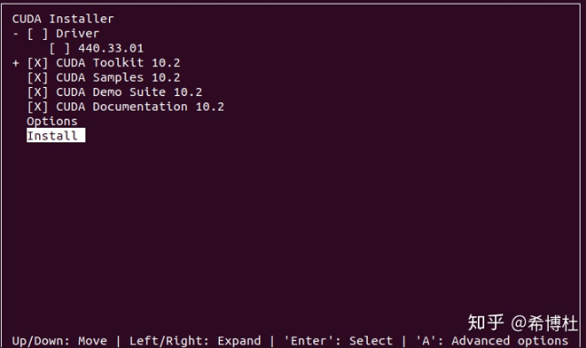

## ubuntu18.04 + GPU 2080ti + cuda10.2  安装配置教程

**显卡和显卡驱动**: 显卡是硬件，显卡驱动可以使显卡正常工作。可以类比到电脑和操作系统。 
**CUDA和显卡驱动**: CUDA是一个工具包，是NVIDIA推出的用于自家GPU上的并行计算框架。CUDA也只能运行于NVIDIA的GPU上 .NVIDIA的显卡驱动器与CUDA并不是一一对应的哦，CUDA本质上只是一个工具包而已。一般情况下，我只需要安装最新版本的显卡驱动，然后根据自己的选择选择不同CUDA工具包就可以了，但是由于使用离线的CUDA总是会捆绑CUDA和驱动程序，所以在使用多个CUDA的时候就不要选择离线安装的CUDA了，否则每次都会安装不同的显卡驱动，这不太好，我们直接**安装一个最新版的显卡驱动，然后在线安装不同版本的CUDA**即可。
**CUDA和cudnn**:cudnn是专门用于神经网络的加速包，CUDA和cudnn也不是一一对应的关系，一个CUDA版本可能有多个版本的cudnn与之对应。

### 1  安装驱动
```bash
## 1 禁用nouveau
sudo gedit /etc/modprobe.d/blacklist.conf 
#在blacklist.conf文件末尾加上这两行，并保存
blacklist nouveau
options nouveau modeset=0
#应用更改
sudo update-initramfs -u 
#重启电脑，验证是否禁用nouveau
lsmod | grep nouveau

#2  安装NVIDIA驱动
# 设置ppa源
sudo add-apt-repository ppa:graphics-drivers/ppa
sudo apt update
# 查看驱动
ubuntu-drivers devices
#  安装新驱动
sudo ubuntu-drivers autoinstall
sudo apt install nvidia-340 
```

### 2 安装CUDA

 安装CUDA，安装版本需要和当前驱动版本对应，具体对应要去[英伟达的官方网站查询](https://link.zhihu.com/?target=https%3A//docs.nvidia.com/cuda/cuda-toolkit-release-notes/index.html)



```bash
# 进行安装cuda10.2
sudo sh cuda_10.2.89_440.33.01_linux.run
# 看到这页面估计是安装完了，输入以下命令验证是否成功： 
cat /usr/local/cuda/version.txt

# 修改环境变量
sudo gedit ~/.bashrc
export LD_LIBRARY_PATH=$LD_LIBRARY_PATH:/usr/local/cuda-10.2/lib64
export PATH=$PATH:/usr/local/cuda-10.2/bin
export CUDA_HOME=$CUDA_HOME:/usr/local/cuda-10.2
source ~/.bashrc
nvcc --version，如果显示下面的文子就说明安装成功了。
```



这个地方不要下载Driver，因为之前已经安装完了，一定要选择CUDA Toolkit 10.2，下面的选填，我觉得把sample下载下来还挺把握，可能安装之后还需要测试一下。接下来点击install 

### 3.安装cuDNN

 到[官网](https://link.zhihu.com/?target=https%3A//developer.nvidia.com/rdp/cudnn-download)下载选择对应的版本， 需要注册登录才能下载。 选择第一个for linux 

```bash
tar -zxvf cudnn-10.0-<自己的版本>.tgz
sudo cp cuda/include/cudnn.h /usr/local/cuda/include/ 
sudo cp cuda/lib64/libcudnn* /usr/local/cuda/lib64/ 
sudo chmod a+r /usr/local/cuda/include/cudnn.h 
sudo chmod a+r /usr/local/cuda/lib64/libcudnn*

cat /usr/local/cuda/include/cudnn.h | grep CUDNN_MAJOR -A 2

export LD_LIBRARY_PATH="$LD_LIBRARY_PATH:/usr/local/cuda/lib64:/usr/local/cuda/extras/CUPTI/lib64"
export CUDA_HOME=/usr/local/cuda
export PATH="CUDAHOME/bin:$PATH"
source ~/.bashrc
# 检测 cudnn 安装是否成功
sudo dpkg -i libcudnn7_7.6.5.32-1+cuda10.2_amd64.deb
sudo dpkg -i libcudnn7-dev_7.6.5.32-1+cuda10.2_amd64.deb
sudo dpkg -i libcudnn7-doc_7.6.5.32-1+cuda10.2_amd64.deb

cd /usr/src/cudnn_samples_v7/mnistCUDNN
sudo make clean
sudo make#出错了，提示没有安装g++,那就安装一下,这里大家遇到的问题可能都不太一样，就是看他缺啥，咱就补啥就行）
#卸载g++:
sudo apt-get remove g++
#重装：
sudo apt-get install g++
./mnistCUDNN
```

### 4 conda 环境配置

```bash
# 安装与配置变量
sh ./Anaconda3-2020.07-Linux-x86_64.sh
sudo gedit ~/.bashrc
export PATH=$PATH:/home/two218/anaconda3/bin
source ~/.bashrc

# 配置镜像源

conda config --add channels https://mirrors.ustc.edu.cn/anaconda/pkgs/main/
conda config --add channels https://mirrors.ustc.edu.cn/anaconda/pkgs/free/
conda config --add channels https://mirrors.ustc.edu.cn/anaconda/cloud/conda-forge/
conda config --add channels https://mirrors.ustc.edu.cn/anaconda/cloud/msys2/
conda config --add channels https://mirrors.ustc.edu.cn/anaconda/cloud/bioconda/
conda config --add channels https://mirrors.ustc.edu.cn/anaconda/cloud/menpo/
conda config --set show_channel_urls yes
conda info
conda config --remove channels

# 配置pytorch环境
conda create -n pytorch python=3.6

# 检测 pytorch环境
import torch
print(torch.__version__)
print(torch.cuda.is_available())

# 配置pytorch-gpu 
conda install pytorch torchvision torchaudio cudatoolkit=10.2 -c pytorch

```

