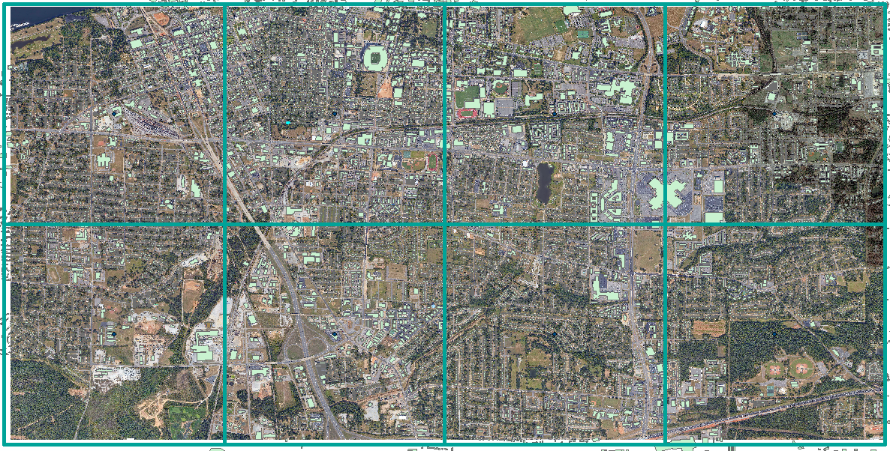
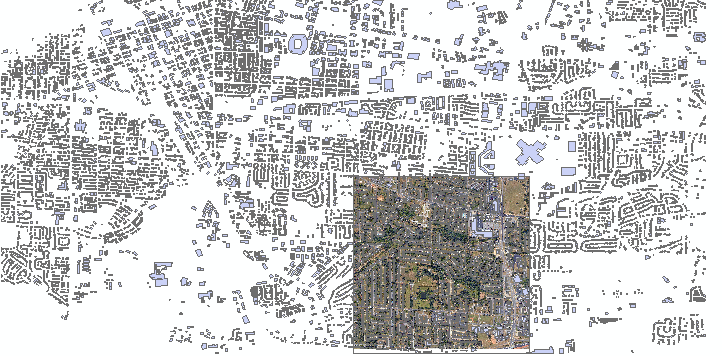

### 深度学习-数据处理

####  1  数据下载

遥感影像数据的下载，利用locaspaceviewer软件实现

矢量数据的下载：利用OSM官网提供的矢量数据

#### 2 制作数据训练集

第一步：构建渔网（数据管理工具-要素类-创建渔网），对遥感影像数据和矢量数据进行切分，主要是方便处理。

第二步：将渔网转面（数据管理工具-要素-要素转面），提取单个面作为掩膜，影像按照（ *Spatial Analyst——>提取分析——>按腌膜提取* ）提取，矢量数据按照（分析工具--提取分析--分割）进行提取。

第三步、遍历矢量数据制作样本集

#### 3 建筑提取方法和实现

 由于地产开发，建筑物轮廓线要素类得不到及时更新，反映不了最新的建筑物轮廓状况。实时更新的数据通常需要花费很多人工成本。那么，我们是否可以用深度学习技术从影像中提取建筑物轮廓线呢？ 

**利用形态学建筑物指数MBI提取建筑物**

 形态学建筑物指数MBI通过建立建筑物的隐式特征和形态学算子之间的关系进行建筑物的提取 。简单来说就是利用MBI处理建筑图像后，利用阈值分割对图像的建筑物进行提取。

**提取建筑物轮廓线**

 模型训练过程并不复杂。在 ArcGIS Notebooks 中，使用 arcgis.learn 模块中的 U-Net 模型就可以进行像素分类。 

使用 Classify Pixels Using Deep Learning 工具，可以生成建筑物轮廓的栅格数据，后期可以使用 ArcGIS Pro 将栅格数据转化成建筑物轮廓线的矢量数据。我们使用 Model Builder 设计整个流程。使用 Model Builder 方便研究者重复运行，方便研究者调试参数。

