### 概率论

#### 1 常用统计分布

##### **正态分布**

 正态分布（Normal distribution）又名高斯分布（Gaussian distribution），是一个在数学、物理及工程等领域都非常重要的概率分布，在统计学的许多方面有着重大的影响力。 

若随机变量X服从一个数学期望为μ、标准方差为σ2的高斯分布，记为：X∼N(μ,σ2),
则其概率密度函数为

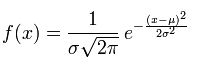

正态分布的期望值μ决定了其位置，其标准差σ决定了分布的幅度。因其曲线呈钟形，因此人们又经常称之为钟形曲线。我们通常所说的标准正态分布是μ = 0,σ = 1的正态分布（见右图中绿色曲线）。

正态分布的概率密度函数均值为μ 方差为σ2 (或标准差σ)是高斯函数的一个实例：

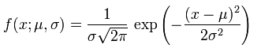

累积分布函数
累积分布函数是指随机变量X小于或等于x的概率，用密度函数表示为

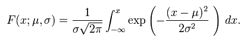

二维高斯概率密度函数

满足下述的[概率密度](https://baike.baidu.com/item/概率密度)分布的随机变量分布叫做二维[正态分布](https://baike.baidu.com/item/正态分布)

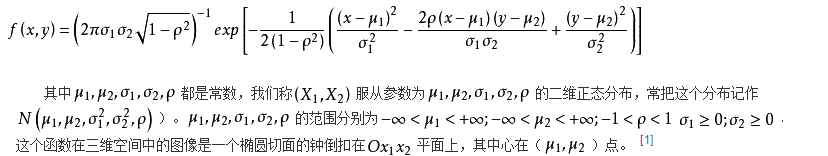

##### **t分布**

假设X服从标准正态分布N(0,1)，Y服从χ2(n)分布，那么Z=X/sqrt(Y/n)的分布称为自由度为n的t分布,记为 Z~t(n)。

相对于正态分布，t分布额外多了一个参数，自由度。自由度 v = n - 1。我们先看几个例子，主观感受一下t分布。

v= 1 ：红色为t分布；蓝色为正态分布。

v= 10，高于v= 1~9的绿色，低于正态分布。

我们首先看一下那条矮的、正态分布的曲线。我们前面说过，正态分布的曲线不具备“宽厚”的特征。它的尾部很低，尾部与横轴之间高度很“狭窄”。也就是说，正态分布不能够容忍它长长的尾部出现大概率的事件（图中横轴值为15处一圆点出现概率为六分之一），所以正态分布就很无奈地，将这一点纳入它的胸膛而非留在尾部。于是乎，**恶果**就出现了：图中**正态分布的均数，远远偏离了大多数点所在的位置，标准差也极大**。总之，与我们所期待的很不一致

##### **卡方分布**

若n个相互独立的随机变量ξ₁、ξ₂、……、ξn ，均服从标准正态分布（也称独立同分布于标准正态分布），则这n个服从标准正态分布的随机变量的平方和∑ξi∧2构成一新的随机变量，其卡方分布分布规律称为χ2(n)分布（chisquare distribution）。其中参数 n 称为自由度，自由度不同就是另一个χ2分布，正如正态分布中均值或方差不同就是另一个正态分布一样。

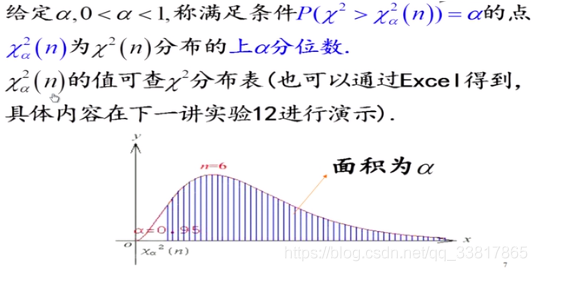

##### **F 分布**

#### 2 概率统计中--常用检测

##### z 检测

 Z检测案例：（方差已知）（H0：原假设； H1：备择假设）

 <u>T检验</u>，亦称student t检验（Student's t test），主要用于样本含量较小（例如n区别二：t分布是z分布的小样本分布，即当总体符合z分布时，从总体中抽取的小样本符合t分布，而对于符合t分布的变量，当样本量增大时，变量数据逐渐向z分布趋近； ）

 T检验是用于小样本（样本容量小于30）的两个平均值差异程度的检验方法。它是用T分布理论来推断差异发生的概率，从而判定两个平均数的差异是否显著。 

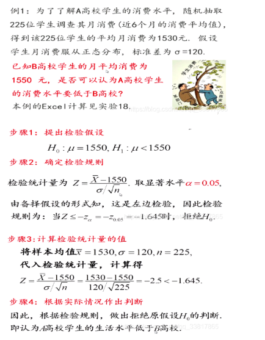

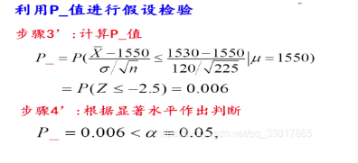

##### T 检测 

 T检测案例：（方差已知）（H0：原假设； H1：备择假设）

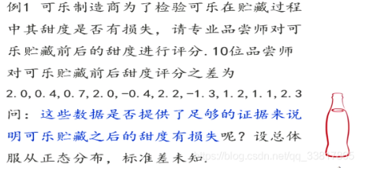

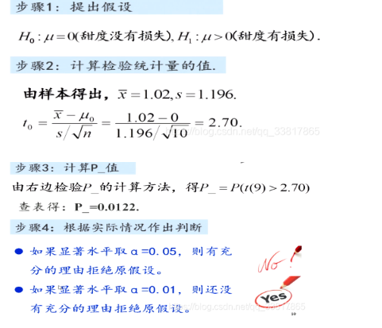

##### 线性检测：F检测和T检测

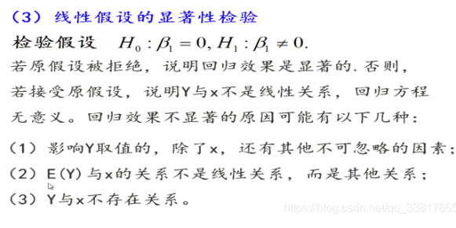

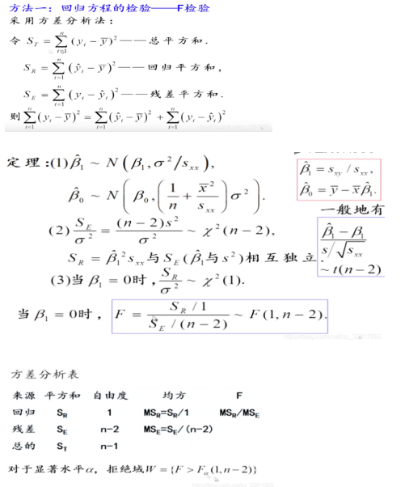

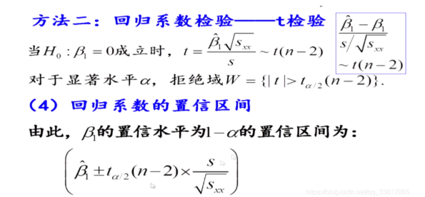

##### 卡方检测

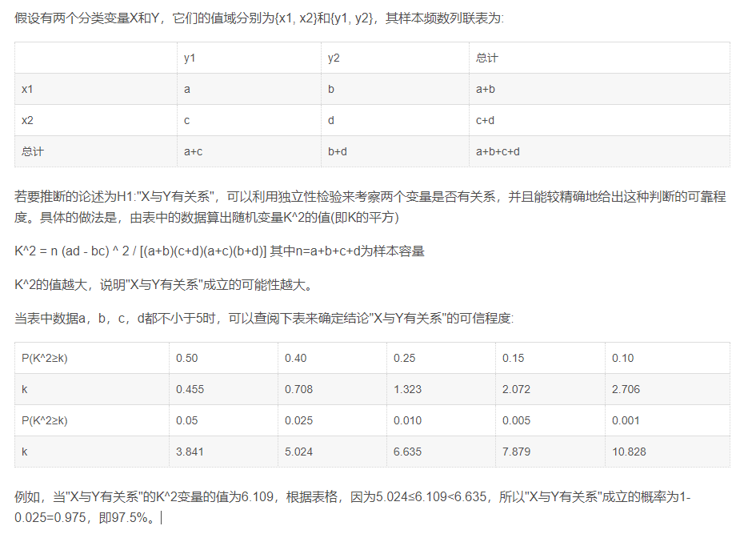

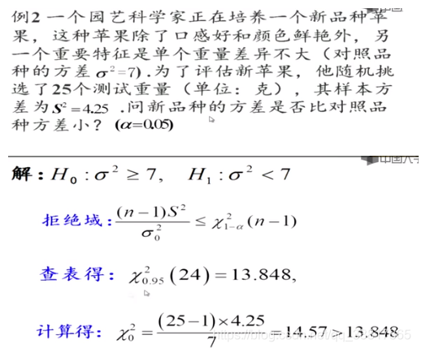

##### F 检测

F检验法是英国统计学家Fisher提出的，主要通过比较两组数据的方差 S^2，以确定他们的精密度是否有<u>显著性差异</u>。样本[标准偏差](https://baike.so.com/doc/1791919-1894890.html)的平方，即("^2"是表示平方):S^2=∑(X-X平均)^2/(n-1)

两组数据就能得到两个S^2值，S大^2和S小^2。F=S大^2/S小^2由表中f大和f小(f为自由度n-1),查得F表，然后计算的F值与查表得到的F表值比较，如果F < F表 表明两组数据没有显著差异;F ≥ F表 表明两组数据存在显著差异

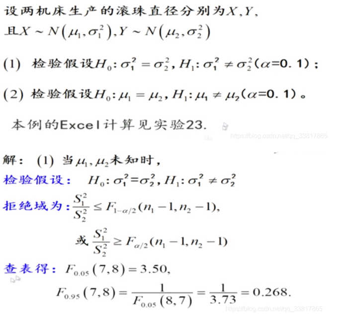

#### 3 统计结果分析

##### 精确率_召回率

又假设，我们不知道这些学生的性别，只知道他们的身高和体重。我们有一个程序(分类器)，这个程序可以通过分析每个学生的身高和体重，对这100个学生的性别分别进行预测。最后的预测结果为，60人为男生，40人为女生，如下图。

TP：实际为男生，预测为男生；

FP：实际为女生，预测为男生；

FN：实际为男生，预测为女生；

TN：实际为女生，预测为女生；

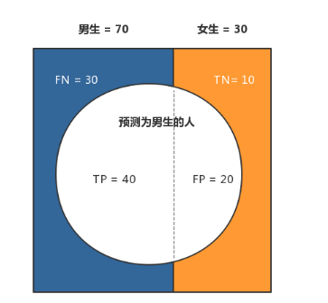

- 准确率(Accuracy) ＝ (TP + TN) / 总样本 ＝(40 + 10)/100 = 50%。 定义是: 对于给定的测试数据集，分类器正确分类的样本数与总样本数之比。
- 精确率(Precision) ＝ TP / (TP + FP) = 40/60 =  66.67%。它表示：预测为正的样本中有多少是真正的正样本，它是针对我们预测结果而言的。Precision又称为查准率。
- 召回率(Recall) ＝ TP / (TP + FN) = 40/70 = 57.14% 。它表示：样本中的正例有多少被预测正确了， 它是针对我们原来的样本而言的。Recall又称为查全率。
- F1是精确率和召回率的调和均值：2/F=1/P+1/R.

##### 损失函数

 **损失函数**用来评价模型的**预测值**和**真实值**不一样的程度，损失函数越好，通常模型的性能越好。不同的模型用的损失函数一般也不一样。 

 **0-1损失**是指预测值和目标值不相等为1， 否则为0: 

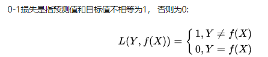

 **交叉熵损失函数**的标准形式如下**:** 

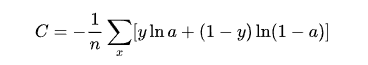

 注意公式中x 表示样本，y 表示实际的标签，a 表示预测的输出，n 表示样本总数量。 